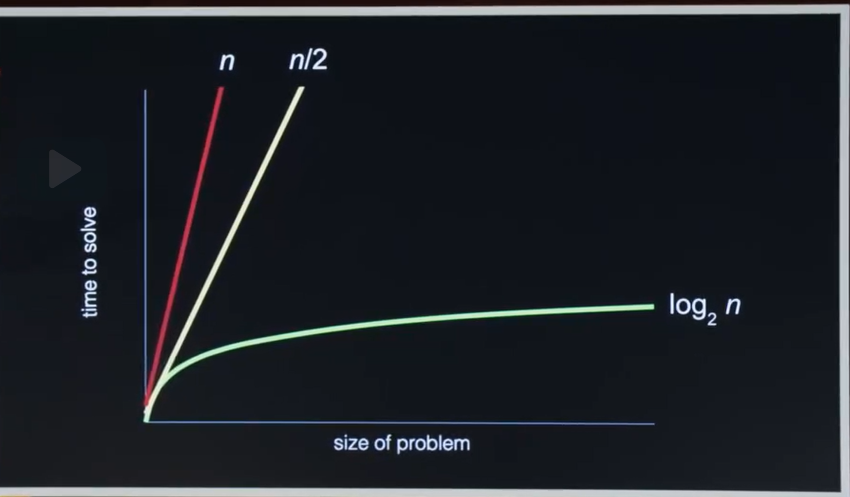
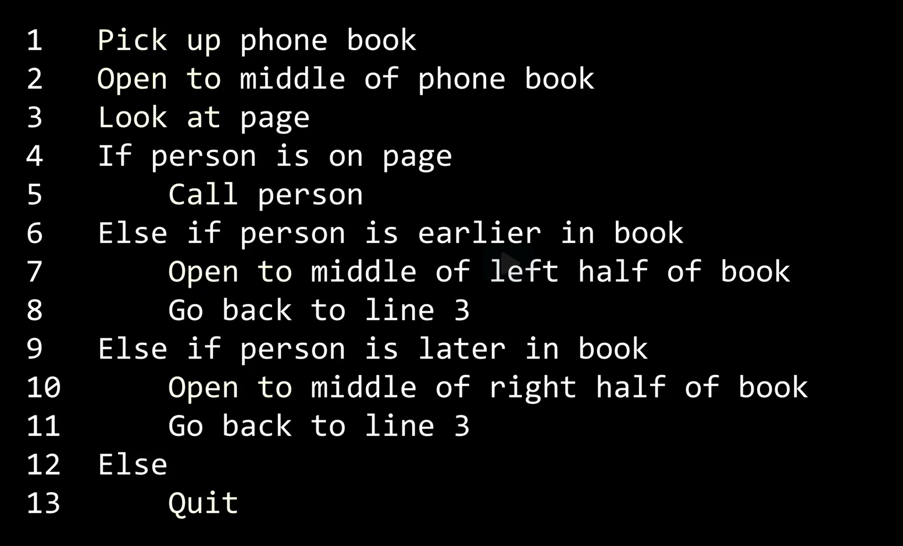

## Problem Solving
Input/Problem => secret sauce => Output/Solution

## Binary System Basics
* Computers fundamentally understand only two states: "on" (1) and "off" (0).
* This binary system, composed of these two states, is the simplest way to   
represent information digitally.
* These states are referred to as binary digits or bits
* Transistors or hardware - On or Off
* Binary digit - 0 and 1
* Unary and Binary Comparison
    * Unary notation is simpler and involves counting with each finger   
    representing a number. However, it’s less efficient than binary.
    * Binary, or base-2, is more efficient as each bit's state (on/off) can   
    combine to represent a larger range of numbers. For instance, five bits can   
    represent numbers up to 31 (from 0 to 31)

## Representing numbers, letters, colors, images, videos, and audio files.

### Representing Numbers
Computers use binary (0s and 1s) to represent numbers. For example,   
the number 65 can be represented in binary as 1000001 .

base-10 system or decimal system
e.g. 123 => 100 + 20 + 3

* Byte - 8 bits
e.g. 11111111 = 255

or 2^8-1 = 255

### Representing Letters
* Letters are represented using ASCII (American Standard Code for Information Interchange).   
For instance, the letter 'A' is represented by the number 65, which in binary is 1000001  
* ASCII uses 7 or 8 bits to represent characters, allowing for 128 or 256 possible values,   
respectively. This is enough for English letters but not sufficient for many other languages  

e.g. A => Assigned a number => underneath the hood it's storing a pattern of 0's and 1's that represents the number 65

01000001

ASCII

* Emoji - It is technically just characters

Unicode - It is a superset of ASCII
It use 16 bit character, 24 bit character and 32 bit character

2^32

We represent things a little more compactly.

U+1F602 => Base 16

Skin tone - Fitzpatrick scale

U+ => It's just visual clue to folks

### Representing Colors
* Colors are represented using RGB (Red, Green, Blue) values. Each   
pixel on a screen is associated with three numbers representing the   
intensity of red, green, and blue, each ranging from 0 to 255 .  

* For example, the combination of medium amounts of red (72), green (73), and a   
little bit of blue (33) creates a yellowish color .
RGB
Pixel

72 73 33

Context matters

### Representing Images
Images are composed of pixels, and each pixel is represented by RGB values.   
Higher resolution images have more pixels, thus requiring more memory to   
store all the RGB values .

3mb 3 million bytes

1 million pixels

### Representing Audio Files
* Audio can be represented digitally by sampling sound waves at regular intervals.   
Each sample is converted into a number, representing the amplitude of the sound wave   
at that point in time .
* Notes in music can be represented by numbers indicating the pitch, duration, and loudness .

Pitch, loud, duration

### Representing Videos

* Videos are essentially sequences of images (frames) displayed rapidly   
in succession. Each frame is an image represented by pixels with RGB values.  

30 frames per second

pictures that are giving the illusion of motion

### Context-Dependent Interpretation
The meaning of binary data (0s and 1s) depends on the context.   
The same sequence can represent different types of data depending   
on how it is interpreted by the software. For example, the sequence   
72 73 33 could represent the text "Hi!" or a color when interpreted   
differently .

### Algorithms

### Pseudocode

cs50.dev

scratch.mid.edu