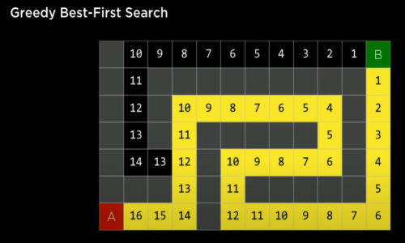

# Introduction
Artificial intelligence covers a wide variety of types of techniques

Examples of AI
1. like recognizing someone's face in a photo
2. being able to play a game better than people can
3. being able to understand human language when we talk to our phones


1. Search
    * AI to be able to search for solutions to some kind of problem
    * get driving directions from point A to point B
    * trying to figure out how to play a game e.g. tic-tac-toe
2. Knowledge
    * AI to be able to know information
    * To be able to represent that information
    * use the information it knows and draw additional conclusions
3. Uncertainty
    * what happens if a computer isn't sure about a fact
    * we'll talk about some of the ideas behind probability
    * how computers can begin to deal with uncertain events
4. Optimization
    * Problems of when the computer is trying to optimize for some sort of goal
    * situation where there might multiple ways that a computer might solve a problem
5. Learning
    * computers can be programmed to be quite intelligent by learning from data
    e.g. Email Inbox somehow knows which are Good emails, spam emails
6. Neural Networks
    * how computers are able to draw inspiration looking at the structure of the human brain
7. Language
    * human languages that we speak every day And taking a look at the challenges that come computer tries to understand natural language


## Search

1. Sliding Window


2. Maze Problem


Analogy - Google Map

* Agent - Entity that perveives its environment and acts upon that environment
e.g. a car
* state - A state is just some configuration of the agent in its environment.


* initial state - The initial state is just the state where the agent begins.
* actions - Actions are just choices that we can make in any given state.
Actions(s) returns the set of actions that can be executed in state s


* transition model - a transition model, which will be a description of what state we get after we perform some available action in some other state.


* state space - the set of all of the states we can get from the initial state via any sequence of actions, by taking zero or one or two or more


* goal test - way to determine whether a given state is a goal state

* path cost - numerical cost associated with a given path


* Search Problems
    * initial state
    * actions
    * transition model
    * goal test
    * path cost

* Solution - 

* Optimal solution - a solution that has lowest path cost among all solutions

* node
    * a data structure that keeps track of 
        * a state
        * a parent(node that generated this node)
        * an action (action applied to parent to get node)
        * a path cost(from initial state to node)

* Approach
    * Start with a frontier that contains the initial state
    * Repeat:
        * If the frontier is empty, then no solution.
        * Remove a node from the frontier.
        * If node contains goal state, return the solution.
        * Expand node, add resulting nodes to the frontier.


What could go wrong?
e.g. if we have two way path


what is the solution to above problem?

By somewhat keeping a track of what is explored

* Revised Approach
    * Start with a frontier that contains the initial state.
    * Start with an empty explored set.
    * Repeat:
        * If the frontier is empty, then no solution.
        * Remove a node from the frontier.
        * If node contains goal state, return the solution.
        * Add the node to the explored set.


> Stack last-in first-out data type


We need to get a visual sense to understand this alogorithm

* It is called Depth-first search
    * search algorithm that always expands the deepeset node in the frontier

* Breadh-first search
    * search algorithm that always expands the shallowest node in the frontier
    * It uses Queue (first-in first-out data type)


e.g. Depth-First Search
Maze Problem - 


is this algorithm always going to work?
yes if it is finite. Eventually it will explore everything  

is it going to be a optimal solution?  
not necessarily  


more optimal solution with less steps.


how does BFS will work in this problem?


It will go in both direction. one step away at same time from A  

so we get optimal solution here with BFS

DFS will pick one and keep following until it hits dead end.

In the larger maze it had to explore a larger set of states.  
so in this we see a some trade-offs.


```
// maze.py

```
So we would like is our Algorithm to be more intelligent. 
In above case it ended up exploring the complete graph.

so if our algorithm knows the coordinates where B is it can make different decision.
Basically in a maze, moving in the coordinate direction of the goal is usually, though not always, a good thing.

## Uninformed search
search strategy that uses no problem specific knowledge
e.g. DFS,BFS
## Informed
search strategy that uses problem-specific knowledge to find solutions more efficiently

* greedy best-first search
    * search algorithm that expands the node that is closest  
    to the goal, as estimated by a heuristic function h(n)


We need to have good heuristic function.

is it optimal?
let's take another example



But above path is not optimal


It is not necessarily optimal. so in actuality there was better  
solution

so we would like to modify our algorithm

## A* search
search algorithm that expands node with lowest value of g(n) + h(n)  

g(n) = cost to reach node  
h(n) = estimated cost to goal


A*search is optimal if
    * h(n) is admissible (never overestimates the true cost), and
    * h(n) is consistent(for every node n and successor n' with step cost c h(n) <= h(n') + c)

Choosing heuristic is important.

# Adversarial Search
Where some other agent is trying to block.
e.g. goal is make 3 x's to win in tic-tac-toe


## Minimax
We need a algorithm where someone is trying to stop our search.

* MAX(X) aims to maximize score.
* MIN(O) aims to minimize score.

### Game
* So : initial state
* PLAYER(s) : returns which player to move in state s
* ACTIONS(s) : returns legal moves in state s
* RESULT(s, a) : returns state after action a taken in state s
* TERMINAL(s) : checks if state s is a terminal state
* UTILITY(s) : final numerical value for terminal state s


This is how a genaral min-max algo might look like


* Given a state s:
    * MAX picks action a in ACTIONS(s) that produces
highest value of MIN-VALUE(Results(s,a))
    * MIN picks action a in ACTIONS(s) that produces
smallest value of MAX-VALUE(Results(s,a))

```
function MAX-VALUE(state):
    if TERMINAL(state):
        return UTILITY(state)
    v = -∞
    for action in ACTIONS(state):
        v = MAX(v, MIN-VALUE(RESULT(state, action)))
    return v

```
### Minimax
```
MIN-VALUE(state):
  if TERMINAL(state):
    return UTILITY(state)
  v = ∞
  for action in ACTIONS(state):
    v = min(v, MAX-VALUE(RESULT(state, action)))
  return v
```
## Alpha-beta Pruning
What optimizations we could make

A way to optimize Minimax, Alpha-Beta Pruning skips some of the recursive computations that are decidedly unfavorable. After establishing the value of one action, if there is initial evidence that the following action can bring the opponent to get to a better score than the already established action, there is no need to further investigate this action because it will decidedly be less favorable than the previously established one.

This is most easily shown with an example: a maximizing player knows that, at the next step, the minimizing player will try to achieve the lowest score. Suppose the maximizing player has three possible actions, and the first one is valued at 4. Then the player starts generating the value for the next action. To do this, the player generates the values of the minimizer’s actions if the current player makes this action, knowing that the minimizer will choose the lowest one. However, before finishing the computation for all the possible actions of the minimizer, the player sees that one of the options has a value of three. This means that there is no reason to keep on exploring the other possible actions for the minimizing player. The value of the not-yet-valued action doesn’t matter, be it 10 or (-10). If the value is 10, the minimizer will choose the lowest option, 3, which is already worse than the preestablished 4. If the not-yet-valued action would turn out to be (-10), the minimizer will this option, (-10), which is even more unfavorable to the maximizer. Therefore, computing additional possible actions for the minimizer at this point is irrelevant to the maximizer, because the maximizing player already has an unequivocally better choice whose value is 4.


* total possible chess games(lower bound) = 10^29000

## Depth - limited Minimax
There is a total of 255,168 possible Tic Tac Toe games, and 10²⁹⁰⁰⁰ possible games in Chess. The minimax algorithm, as presented so far, requires generating all hypothetical games from a certain point to the terminal condition. While computing all the Tic-Tac-Toe games doesn’t pose a challenge for a modern computer, doing so with chess is currently impossible.

Depth-limited Minimax considers only a pre-defined number of moves before it stops, without ever getting to a terminal state. However, this doesn’t allow for getting a precise value for each action, since the end of the hypothetical games has not been reached. To deal with this problem, Depth-limited Minimax relies on an evaluation function that estimates the expected utility of the game from a given state, or, in other words, assigns values to states. For example, in a chess game, a utility function would take as input a current configuration of the board, try to assess its expected utility (based on what pieces each player has and their locations on the board), and then return a positive or a negative value that represents how favorable the board is for one player versus the other. These values can be used to decide on the right action, and the better the evaluation function, the better the Minimax algorithm that relies on it.

Evaluation function - function that estimates the expected utility of the game from a given state.


