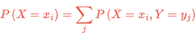
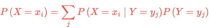
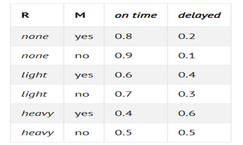

# Uncertainty


## Probability

Possible Worlds - ω

P(ω)

* Probability will range from 0 and 1

0 <= P(ω) <=1


for example in a dice each number will have 1/6 of probability.

* What if we have two dice

All of the possible worlds are


and their sum are


P(sum to 12) = 1/36
P(sum to 7) = 6/36 = 1/6

## Unconditional Probability

degree of belief in a proposition in the absence of any other evidence.

## Conditional Probability

degree of belief in a proposition given some evidence that has already been revealed

e.g. P(a|b)
what is the probability of a given b
e.g.  
P(rain today | rain yesterday)

e.g.  
P(route change | traffic conditions)

e.g.  
P(disease | test results)

### How to calculate conditional probability


## random variable

a variable in probability theory with a domain of possible values it can take on  
e.g.  
Weather - {sun, cloud, rain, wind, snow}  
traffic - {none, light, heavy}  
Flight - {on time, delayed, cancelled}  

probability distribution  
P(Flight = on time) = 0.6  
P(Flight = delayed) = 0.3  
P(Flight = cancelled) = 0.1

This notation a little bit might be confusing  
P(Flight) = <0.6,0.3,0.1>

### independence

the knowledge that one event occurs does
not affect the probability of the other event


### Bayes' Rule

Bayes' Rule, also known as Bayes' Theorem, is a fundamental concept in probability theory that describes how to update the probability of a hypothesis based on new evidence. It provides a way to calculate the posterior probability (the updated probability of an event) given the prior probability (the initial belief) and the likelihood of observing the evidence.

Intuition
Bayes' Rule helps in understanding how new evidence affects your belief about a hypothesis. If the evidence is highly likely given the hypothesis, the posterior probability increases. Conversely, if the evidence is unlikely given the hypothesis, the posterior probability decreases.


>> knowing  
P(cloudy morning | rainy afternoon)  
We can calculate
P(rainy afternoon | cloudy morning)  

>> Knowing  
P(visible effect | unknown cause)
We can calculate  
P(unknown cause | visible effect)

```
Knowing
P(blurry text | counterfeit bill)
We can calculate
P(counterfeit bill | blurry text)
```

## Joint Probability

**Joint probability** refers to the probability of two or more events happening simultaneously. It is the likelihood that two (or more) events occur at the same time or in conjunction with one another.

For two events, A and B, the joint probability is denoted as `P(A ∩ B)`, which represents the probability that both A and B happen together.

## Formula for Joint Probability

If A and B are independent events (meaning the occurrence of one event does not affect the other), the joint probability can be calculated as:

P(A ∩ B) = P(A) × P(B)


## Probability Rules

* **Negation:** P(¬a) = 1 - P(a). This stems from the fact that the sum of the probabilities of all the possible worlds is 1, and the complementary literals a and ¬a include all the possible worlds.

* **Inclusion-Exclusion:** P(a ∨ b) = P(a) + P(b) - P(a ∧ b). This can interpreted in the following way: the worlds in which a or b are true are equal to all the worlds where a is true, plus the worlds where b is true. However, in this case, some worlds are counted twice (the worlds where both a and b are true)). To get rid of this overlap, we subtract once the worlds where both a and b are true (since they were counted twice).

> Here is an example from outside lecture that can elucidate this. Suppose I eat ice cream 80% of days and cookies 70% of days. If we’re calculating the probability that today I eat ice cream or cookies P(ice cream ∨ cookies) without subtracting P(ice cream ∧ cookies), we erroneously end up with 0.7 + 0.8 = 1.5. This contradicts the axiom that probability ranges between 0 and 1. To correct for counting twice the days when I ate both ice cream and cookies, we need to subtract P(ice cream ∧ cookies) once.

* Marginalization: P(a) = P(a, b) + P(a, ¬b). The idea here is that b and ¬b are disjoint probabilities. That is, the probability of b and ¬b occurring at the same time is 0. We also know b and ¬b sum up to 1. Thus, when a happens, b can either happen or not. When we take the probability of both a and b happening in addition to the probability of a and ¬b, we end up with simply the probability of a.

* Marginalization can be expressed for random variables the following way:



The left side of the equation means “The probability of random variable X having the value xᵢ.” For example, for the variable C we mentioned earlier, the two possible values are clouds in the morning and no clouds in the morning. The right part of the equation is the idea of marginalization. P(X = xᵢ) is equal to the sum of all the joint probabilities of xᵢ and every single value of the random variable Y. For example, P(C = cloud) = P(C = cloud, R = rain) + P(C = cloud, R = ¬rain) = 0.08 + 0.32 = 0.4.

* Conditioning: P(a) = P(a | b)P(b) + P(a | ¬b)P(¬b). This is a similar idea to marginalization. The probability of event a occurring is equal to the probability of a given b times the probability of b, plus the probability of a given ¬b time the probability of ¬b.



## Bayesian Networks

A Bayesian network is a data structure that represents the dependencies among random variables. Bayesian networks have the following properties:

* They are directed graphs.
* Each node on the graph represent a random variable.
* An arrow from X to Y represents that X is a parent of Y. That is, the probability distribution of Y depends on the value of X.
* Each node X has probability distribution P(X | Parents(X)).


Let’s describe this Bayesian network from the top down:

* Rain is the root node in this network. This means that its probability distribution is not reliant on any prior event. In our example, Rain is a random variable that can take the values {none, light, heavy} with the following probability distribution:

|none|light|heavy|
|---|---|---|
| 0.7 | 0.2 | 0.1 |


* Maintenance, in our example, encodes whether there is train track maintenance, taking the values {yes, no}. Rain is a parent node of Maintenance, which means that the probability distribution of Maintenance is affected by Rain.

|R|yes|no|
|---|---|---|
| none | 0.4 | 0.6 |
| light | 0.2 | 0.8 |
|heavey|0.1|0.9|


* Train is the variable that encodes whether the train is on time or delayed, taking the values {on time, delayed}. Note that Train has arrows pointing to it from both Maintenance and Rain. This means that both are parents of Train, and their values affect the probability distribution of Train.



* Appointment is a random variable that represents whether we attend our appointment, taking the values {attend, miss}. Note that its only parent is Train. This
point about Bayesian network is noteworthy: parents include only direct relations. It is true that maintenance affects whether the train is on time, and whether
the train is on time affects whether we attend the appointment. However, in the end, what directly affects our chances of attending the appointment is whether
the train came on time, and this is what is represented in the Bayesian network. For example, if the train came on time, it could be heavy rain and track
maintenance, but that has no effect over whether we made it to our appointment.

|T|attend|miss|
|---|---|---|
| ontime | 0.9 | 0.1 |
|delayed|0.6|0.4|

* For example, if we want to find the probability of missing the meeting when the train was delayed on a day with no maintenance and light rain, or P(light, no, delayed, miss), we will compute the following: P(light)P(no | light)P(delayed | light, no)P(miss | delayed). The value of each of the individual probabilities can be found in the probability distributions above, and then these values are multiplied to produce P(no, light, delayed, miss).