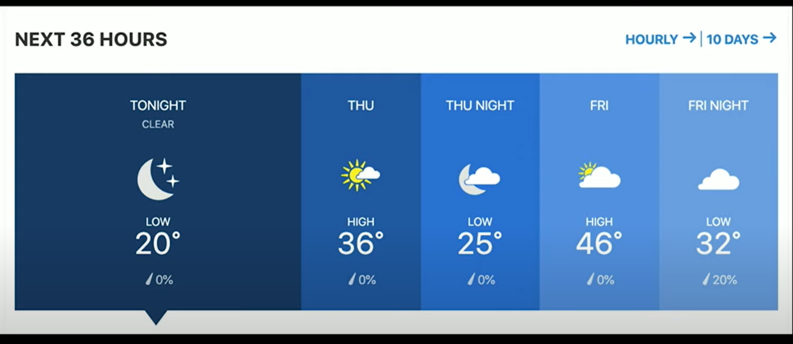
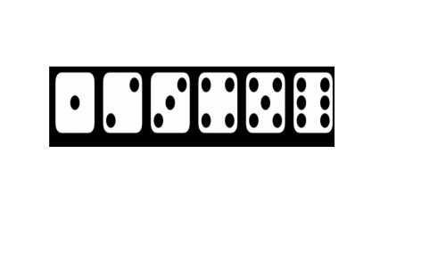
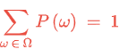
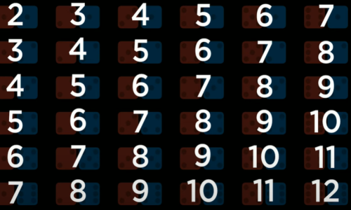
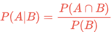
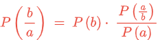
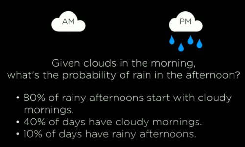
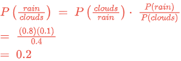
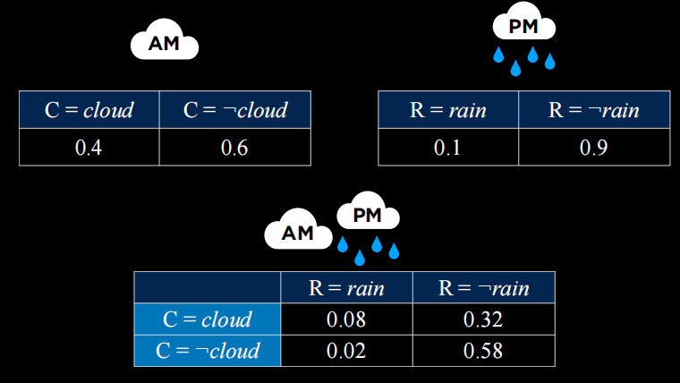

# Uncertainty






## Probability

Possible Worlds - ω

P(ω)

* Probability will range from 0 and 1

0 <= P(ω) <=1



for example in a dice each number will have 1/6 of probability.

* What if we have two dice

All of the possible worlds are


and their sum are



P(sum to 12) = 1/36
P(sum to 7) = 6/36 = 1/6

## Unconditional Probability

degree of belief in a proposition in the absence of any other evidence.

## Conditional Probability

degree of belief in a proposition given some evidence that has already been revealed

e.g. P(a|b)
what is the probability of a given b
e.g.  
P(rain today | rain yesterday)

e.g.  
P(route change | traffic conditions)

e.g.  
P(disease | test results)

### How to calculate conditional probability



## random variable

a variable in probability theory with a domain of possible values it can take on  
e.g.  
Weather - {sun, cloud, rain, wind, snow}  
traffic - {none, light, heavy}  
Flight - {on time, delayed, cancelled}  

probability distribution  
P(Flight = on time) = 0.6  
P(Flight = delayed) = 0.3  
P(Flight = cancelled) = 0.1

This notation a little bit might be confusing  
P(Flight) = <0.6,0.3,0.1>

### independence

the knowledge that one event occurs does
not affect the probability of the other event


### Bayes' Rule







>> knowing  
P(cloudy morning | rainy afternoon)  
We can calculate
P(rainy afternoon | cloudy morning)  

>> Knowing  
P(visible effect | unknown cause)
We can calculate  
P(unknown cause | visible effect)

```
Knowing
P(blurry text | counterfeit bill)
We can calculate
P(counterfeit bill | blurry text)
```

## Joint Probability


