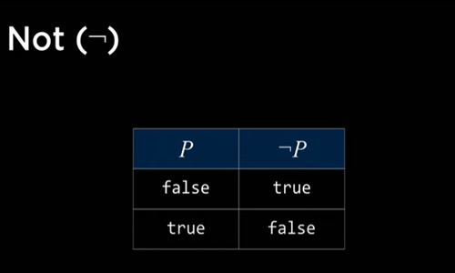
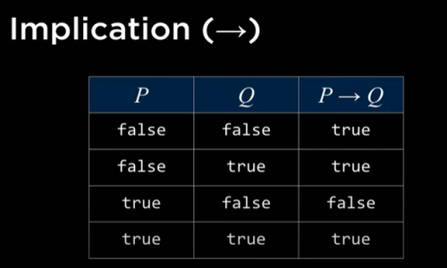
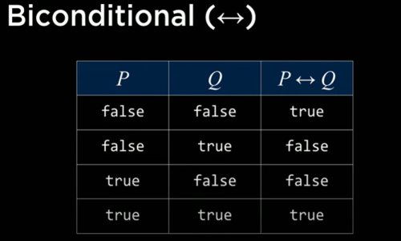
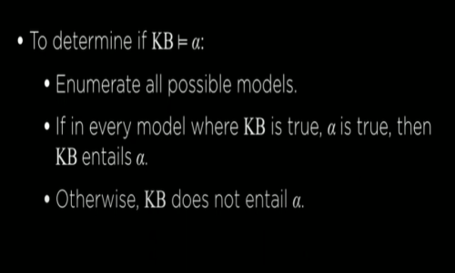
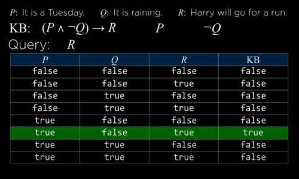

## knowledge-based agents
agents that reason by operating on internal representations of knowledge

* If it didn't rain, Harry visited Hagrid today.
* Harry visited Hagrid or Dumbledore today, but not both
* Harry visited Dumbledore today.

=> Harry did not visit Hagrid today.
=> It rained today.

## sentence
an assertion about the world in a knowledge representation language

## Propositional logic

* Symbols - P, Q, R
* Logical Connectives
not ~
and ^
or | v
implication =>
biconditional <=>



### And ^

|P|Q|P^Q|
|-|-|-|
|false|false|false|
|false | true | false|
| true | false | false|
|true | true | true|

### Or (v)

|P|Q| PvQ|
|-|-|-|
|false|false|false|
|false|true|true|
|true|false|true|
|true|true|true|

### Implication =>



### Biconditional <=>



### Model

```
A model in AI or machine learning is a set of instructions or rules that helps a computer understand how to make predictions or decisions. It learns from past experiences (data) to figure out what will happen next. For example, if an AI model has learned from many photos of dogs, it can predict whether a new picture shows a dog.
```

## Why to assign true or false?
```
Assigning truth values to propositions is essential in logical systems and AI reasoning for several reasons, primarily to evaluate the validity of statements, derive conclusions, and simulate possible worlds or scenarios. Here's why this assignment process is important:

1. Defining Meaning and Truth
Propositions are abstract statements about the world, but their meaning depends on whether they are true or false in a specific context.
Assigning a truth value to propositions gives us a way to evaluate their truthfulness, which is necessary for logical reasoning. Without assigning truth values, it would be impossible to make any formal judgments about the propositions' correctness or applicability in a given situation.
Example:
If you have a proposition like "The sky is blue," it’s meaningless unless we know whether this statement is true or false in a given context (e.g., during the day vs. at night).
```


The model is an assignment of a truth value to every proposition.   
To reiterate, propositions are statements about the world that can be either true or false.  
However, knowledge about the world is represented in the truth values of these   propositions.   
The model is the truth-value assignment that provides information   
about the world.

For example, if P: “It is raining.” and Q: “It is Tuesday.”,   
a model could be the following truth-value assignment: {P = True, Q = False}.   
This model means that it is raining, but it is not Tuesday.   
However, there are more possible models in this situation (for example, {P = True,   
Q = True}, where it is both raining and a Tuesday).   
In fact, the number of possible models is 2 to the power of the number of propositions.   
In this case, we had 2 propositions, so 2²=4 possible models.

### Knowledge Base (KB)
```
In Artificial Intelligence (AI), a Knowledge Base (KB) is a centralized repository of 
information used to store, organize, and retrieve knowledge. It is a critical component 
of various AI systems, especially expert systems, and is designed to help these systems 
make decisions, reason, and solve complex problems by simulating human expertise. 
A knowledge base can include facts, rules, relationships, concepts, and other types 
of structured or unstructured data relevant to a particular domain.
```

The knowledge base is a set of sentences known by a knowledge-based agent.   
This is knowledge that the AI is provided about the world in the form of   
propositional logic sentences that can be used to make additional   
inferences about the world.

### Entailment (⊨)
Entailment refers to a logical relationship between two statements where one statement   
necessarily follows from another. If a statement A entails a statement B, then B must be true if A is true.


```
For example, if an AI knows that:
"All humans are mortal" (A),
"Socrates is a human" (B),
then it can logically entail that "Socrates is mortal" (C).
```

If α ⊨ β (α entails β), then in any world where α is true, β is true, too.

For example, if α: “It is a Tuesday in January” and β: “It is January,”   
then we know that α ⊨ β. If it is true that it is a Tuesday in January,   
we also know that it is January. Entailment is different from implication.   
Implication is a logical connective between two propositions.   
Entailment, on the other hand, is a relation that means that   
if all the information in α is true, then all the information in β is true.

## Inference
**Inference is the process of deriving new sentences from old ones.**

```
Logical Inference
Inference is the process of deriving new truths (conclusions) from known truths (premises). 
To infer new information, we need to know the truth values of the propositions involved.
By assigning truth values, a logical system can determine whether certain conclusions follow 
from a set of premises (this is where entailment comes in).
Example:
Consider the propositions:
P: "If it rains, the ground will be wet."
Q: "It is raining."
R: "The ground is wet."
```

For instance, in the Harry Potter example earlier, sentences 4 and 5 were inferred   
from sentences 1, 2, and 3.

There are multiple ways to infer new knowledge based on existing knowledge.   
First, we will consider the Model Checking algorithm.

To determine if KB ⊨ α (in other words, answering the question: “can we conclude that   
α is true based on our knowledge base”)  
Enumerate all possible models.
If in every model where KB is true, α is true as well, then KB entails α (KB ⊨ α).
Consider the following example:

P: It is a Tuesday.   
Q: It is raining.   
R: Harry will go for a run. 

KB: (P ∧ ¬Q) → R 
(in words, P and not Q imply R) P (P is true) ¬Q (Q is false) Query: R (We want to know whether R is true or false; Does KB ⊨ R?)

To answer the query using the Model Checking algorithm, we enumerate all possible models

# Model Checking
```
Model checking is a formal verification technique used to systematically check whether a model of a system satisfies certain specifications or properties. It is widely used in computer science, particularly in verifying the correctness of hardware and software systems. The goal of model checking is to ensure that a system behaves as intended under all possible conditions.
```






Consider a model checking problem where we want to verify that a program controlling a traffic light never displays green lights for both directions at the same time. We model the states of the traffic light system and use model checking to ensure that this condition is never violated.

Model checking is an essential tool in areas requiring high reliability, such as avionics, automotive systems, and chip design.

**Knowledge Engineering** is the process of building intelligent systems by capturing, structuring, and utilizing human knowledge. It involves designing and developing knowledge-based systems (such as expert systems) that can simulate human decision-making, reasoning, and problem-solving. Knowledge engineering is a key discipline within artificial intelligence (AI), where the goal is to transfer expert knowledge into a machine-readable format that can be used for inference, learning, or decision-making.

### Key Components of Knowledge Engineering:

1. **Knowledge Acquisition**:
   - Gathering knowledge from experts, databases, documents, and other sources.
   - This involves extracting domain-specific knowledge and identifying how experts reason about problems.
   - Techniques include interviews with experts, mining data, or using tools like machine learning to extract knowledge automatically.

2. **Knowledge Representation**:
   - Structuring and organizing the acquired knowledge in a formal way that machines can process.
   - Common methods of knowledge representation include:
     - **Rules** (e.g., if-then rules used in expert systems).
     - **Ontologies** (formal representation of concepts and relationships within a domain).
     - **Semantic Networks** (graphs showing how concepts are related).
     - **Frames** (structured templates for describing objects and their attributes).
     - **Logical Formulas** (used for precise, mathematical reasoning).

3. **Knowledge Validation**:
   - Ensuring that the acquired knowledge is accurate, relevant, and complete. It involves testing the knowledge against known scenarios to ensure that the system behaves as expected.
   - This step may involve working with experts to confirm that the system’s reasoning aligns with real-world decisions.

4. **Knowledge Integration**:
   - Combining different sources of knowledge (human expertise, databases, rules) into a cohesive system.
   - Ensuring the integration of new knowledge into existing systems without conflicts or loss of performance.

5. **Inference Mechanisms**:
   - Developing methods to use the knowledge for problem-solving, decision-making, or reasoning.
   - **Inference engines** are used to draw conclusions from the knowledge base. This can involve rule-based reasoning, deductive reasoning, or probabilistic reasoning.

6. **Maintenance**:
   - Regularly updating the knowledge base to reflect changes in the domain or correct inaccuracies. This is essential since knowledge in many fields evolves over time.

### Steps in Knowledge Engineering:

1. **Define the Problem Domain**: Identify the domain where expert knowledge is needed and what problem the system aims to solve.
2. **Acquire Knowledge**: Work with human experts or gather data from other sources.
3. **Structure Knowledge**: Choose an appropriate knowledge representation method.
4. **Develop the Knowledge Base**: Implement the acquired knowledge into the system.
5. **Develop the Inference Engine**: Create mechanisms that allow the system to make decisions or provide advice.
6. **Test and Validate the System**: Ensure the system’s output is accurate and consistent with expert advice.
7. **Deploy the System**: Make the system available for use in solving real-world problems.

### Applications of Knowledge Engineering:

1. **Expert Systems**: AI systems that replicate decision-making processes of human experts (e.g., medical diagnosis systems, troubleshooting guides).
2. **Decision Support Systems**: Systems that help users make complex decisions based on expert knowledge (e.g., financial planning systems).
3. **Natural Language Processing (NLP)**: Understanding and generating human language by encoding linguistic knowledge.
4. **Robotics and Automation**: Systems that use expert knowledge to perform tasks autonomously in environments like manufacturing or medical fields.
5. **Knowledge Management**: Organizing and sharing knowledge in organizations for improved decision-making.

### Example:
In medical diagnosis, knowledge engineers might work with doctors to encode medical expertise into a system. The system would then analyze symptoms, medical history, and diagnostic tests to suggest possible diagnoses, acting as a decision-support tool for healthcare professionals.

### Challenges in Knowledge Engineering:
- **Knowledge Acquisition Bottleneck**: Extracting knowledge from experts can be time-consuming and difficult.
- **Representation Complexity**: Choosing the right format for representing knowledge in a machine-understandable way is often challenging.
- **Maintaining Up-to-date Knowledge**: Ensuring that the knowledge base reflects new discoveries or changes in the domain is crucial, especially in fast-evolving fields.

### Importance:
Knowledge engineering plays a central role in AI and cognitive computing, enabling machines to solve complex tasks that typically require human expertise. It bridges the gap between human expertise and machine intelligence, allowing AI systems to function in areas like healthcare, law, finance, and more.


