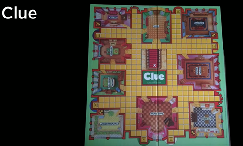
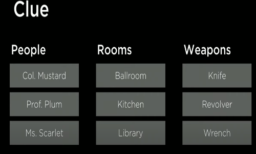
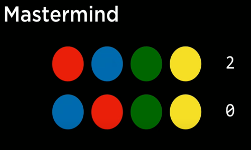

## knowledge-based agents
agents that reason by operating on internal representations of knowledge

* If it didn't rain, Harry visited Hagrid today.
* Harry visited Hagrid or Dumbledore today, but not both
* Harry visited Dumbledore today.

=> Harry did not visit Hagrid today.
=> It rained today.

## sentence
an assertion about the world in a knowledge representation language

## Propositional logic

* Symbols - P, Q, R
* Logical Connectives
not ~
and ^
or | v
implication =>
biconditional <=>


### And ^

|P|Q|P^Q|
|-|-|-|
|false|false|false|
|false | true | false|
| true | false | false|
|true | true | true|

### Or (v)

|P|Q| PvQ|
|-|-|-|
|false|false|false|
|false|true|true|
|true|false|true|
|true|true|true|

### Implication =>


### Biconditional <=>


### Model

```
A model in AI or machine learning is a set of instructions or rules that helps a computer understand how to make predictions or decisions. It learns from past experiences (data) to figure out what will happen next. For example, if an AI model has learned from many photos of dogs, it can predict whether a new picture shows a dog.
```

## Why to assign true or false?
```
Assigning truth values to propositions is essential in logical systems and AI reasoning for several reasons, primarily to evaluate the validity of statements, derive conclusions, and simulate possible worlds or scenarios. Here's why this assignment process is important:

1. Defining Meaning and Truth
Propositions are abstract statements about the world, but their meaning depends on whether they are true or false in a specific context.
Assigning a truth value to propositions gives us a way to evaluate their truthfulness, which is necessary for logical reasoning. Without assigning truth values, it would be impossible to make any formal judgments about the propositions' correctness or applicability in a given situation.
Example:
If you have a proposition like "The sky is blue," it’s meaningless unless we know whether this statement is true or false in a given context (e.g., during the day vs. at night).
```


The model is an assignment of a truth value to every proposition.   
To reiterate, propositions are statements about the world that can be either true or false.  
However, knowledge about the world is represented in the truth values of these   propositions.   
The model is the truth-value assignment that provides information   
about the world.

For example, if P: “It is raining.” and Q: “It is Tuesday.”,   
a model could be the following truth-value assignment: {P = True, Q = False}.   
This model means that it is raining, but it is not Tuesday.   
However, there are more possible models in this situation (for example, {P = True,   
Q = True}, where it is both raining and a Tuesday).   
In fact, the number of possible models is 2 to the power of the number of propositions.   
In this case, we had 2 propositions, so 2²=4 possible models.

### Knowledge Base (KB)
```
In Artificial Intelligence (AI), a Knowledge Base (KB) is a centralized repository of 
information used to store, organize, and retrieve knowledge. It is a critical component 
of various AI systems, especially expert systems, and is designed to help these systems 
make decisions, reason, and solve complex problems by simulating human expertise. 
A knowledge base can include facts, rules, relationships, concepts, and other types 
of structured or unstructured data relevant to a particular domain.
```

The knowledge base is a set of sentences known by a knowledge-based agent.   
This is knowledge that the AI is provided about the world in the form of   
propositional logic sentences that can be used to make additional   
inferences about the world.

### Entailment (⊨)
Entailment refers to a logical relationship between two statements where one statement   
necessarily follows from another. If a statement A entails a statement B, then B must be true if A is true.


```
For example, if an AI knows that:
"All humans are mortal" (A),
"Socrates is a human" (B),
then it can logically entail that "Socrates is mortal" (C).
```

If α ⊨ β (α entails β), then in any world where α is true, β is true, too.

For example, if α: “It is a Tuesday in January” and β: “It is January,”   
then we know that α ⊨ β. If it is true that it is a Tuesday in January,   
we also know that it is January. Entailment is different from implication.   
Implication is a logical connective between two propositions.   
Entailment, on the other hand, is a relation that means that   
if all the information in α is true, then all the information in β is true.

## Inference
**Inference is the process of deriving new sentences from old ones.**

```
Logical Inference
Inference is the process of deriving new truths (conclusions) from known truths (premises). 
To infer new information, we need to know the truth values of the propositions involved.
By assigning truth values, a logical system can determine whether certain conclusions follow 
from a set of premises (this is where entailment comes in).
Example:
Consider the propositions:
P: "If it rains, the ground will be wet."
Q: "It is raining."
R: "The ground is wet."
```

For instance, in the Harry Potter example earlier, sentences 4 and 5 were inferred   
from sentences 1, 2, and 3.

There are multiple ways to infer new knowledge based on existing knowledge.   
First, we will consider the Model Checking algorithm.

To determine if KB ⊨ α (in other words, answering the question: “can we conclude that   
α is true based on our knowledge base”) 

Enumerate all possible models.  
If in every model where KB is true, α is true as well, then KB entails α (KB ⊨ α).
Consider the following example:

P: It is a Tuesday.   
Q: It is raining.   
R: Harry will go for a run. 

KB: (P ∧ ¬Q) → R 
(in words, P and not Q imply R) P (P is true) ¬Q (Q is false) Query: R (We want to know   
whether R is true or false; Does KB ⊨ R?)

To answer the query using the Model Checking algorithm, we enumerate all possible models

# Model Checking
```
Model checking is a formal verification technique used to systematically check whether a   
model of a system satisfies certain specifications or properties. It is widely used in   
computer science, particularly in verifying the correctness of hardware and software systems.   
The goal of model checking is to ensure that a system behaves as intended under all possible   
conditions.
```


Consider a model checking problem where we want to verify that a program controlling a   
traffic light never displays green lights for both directions at the same time. We model   
the states of the traffic light system and use model checking to ensure that this condition   
is never violated.

Model checking is an essential tool in areas requiring high reliability, such as avionics,   
automotive systems, and chip design.

**Knowledge Engineering** is the process of building intelligent systems by capturing, structuring,   
and utilizing human knowledge. It involves designing and developing knowledge-based systems (such as   
expert systems) that can simulate human decision-making, reasoning, and problem-solving. Knowledge   
engineering is a key discipline within artificial intelligence (AI), where the goal is to transfer   
expert knowledge into a machine-readable format that can be used for inference, learning, or   
decision-making.

### Key Components of Knowledge Engineering:

1. **Knowledge Acquisition**:
   - Gathering knowledge from experts, databases, documents, and other sources.
   - This involves extracting domain-specific knowledge and identifying how experts reason about problems.
   - Techniques include interviews with experts, mining data, or using tools like machine   
   learning to extract knowledge automatically.

2. **Knowledge Representation**:
   - Structuring and organizing the acquired knowledge in a formal way that machines can process.
   - Common methods of knowledge representation include:
     - **Rules** (e.g., if-then rules used in expert systems).
     - **Ontologies** (formal representation of concepts and relationships within a domain).
     - **Semantic Networks** (graphs showing how concepts are related).
     - **Frames** (structured templates for describing objects and their attributes).
     - **Logical Formulas** (used for precise, mathematical reasoning).

3. **Knowledge Validation**:
   - Ensuring that the acquired knowledge is accurate, relevant, and complete.   
   It involves testing the knowledge against known scenarios to ensure that the system behaves as expected.
   - This step may involve working with experts to confirm that the system’s reasoning   
   aligns with real-world decisions.

4. **Knowledge Integration**:
   - Combining different sources of knowledge (human expertise, databases, rules) into a cohesive system.
   - Ensuring the integration of new knowledge into existing systems without conflicts or loss of performance.

5. **Inference Mechanisms**:
   - Developing methods to use the knowledge for problem-solving, decision-making, or reasoning.
   - **Inference engines** are used to draw conclusions from the knowledge base.   
   This can involve rule-based reasoning, deductive reasoning, or probabilistic reasoning.

6. **Maintenance**:
   - Regularly updating the knowledge base to reflect changes in the domain or correct inaccuracies.   
   This is essential since knowledge in many fields evolves over time.

### Steps in Knowledge Engineering:

1. **Define the Problem Domain**: Identify the domain where expert knowledge is needed and   
what problem the system aims to solve.
2. **Acquire Knowledge**: Work with human experts or gather data from other sources.
3. **Structure Knowledge**: Choose an appropriate knowledge representation method.
4. **Develop the Knowledge Base**: Implement the acquired knowledge into the system.
5. **Develop the Inference Engine**: Create mechanisms that allow the system to make   
decisions or provide advice.
6. **Test and Validate the System**: Ensure the system’s output is accurate and consistent   
with expert advice.
7. **Deploy the System**: Make the system available for use in solving real-world problems.

### Applications of Knowledge Engineering:

1. **Expert Systems**: AI systems that replicate decision-making processes of human   
experts (e.g., medical diagnosis systems, troubleshooting guides).
2. **Decision Support Systems**: Systems that help users make complex decisions based   
on expert knowledge (e.g., financial planning systems).
3. **Natural Language Processing (NLP)**: Understanding and generating human language by   
encoding linguistic knowledge.
4. **Robotics and Automation**: Systems that use expert knowledge to perform tasks autonomously   
in environments like manufacturing or medical fields.
5. **Knowledge Management**: Organizing and sharing knowledge in organizations for improved   
decision-making.

### Example:
In medical diagnosis, knowledge engineers might work with doctors to encode medical   
expertise into a system. The system would then analyze symptoms, medical history, and   
diagnostic tests to suggest possible diagnoses, acting as a decision-support tool for   
healthcare professionals.

### Challenges in Knowledge Engineering:
- **Knowledge Acquisition Bottleneck**: Extracting knowledge from experts can be time-consuming   
and difficult.
- **Representation Complexity**: Choosing the right format for representing knowledge in a   
machine-understandable way is often challenging.
- **Maintaining Up-to-date Knowledge**: Ensuring that the knowledge base reflects new discoveries   
or changes in the domain is crucial, especially in fast-evolving fields.

### Importance:
Knowledge engineering plays a central role in AI and cognitive computing,   
enabling machines to solve complex tasks that typically require human expertise.   
It bridges the gap between human expertise and machine intelligence, allowing AI   
systems to function in areas like healthcare, law, finance, and more.


#### Examples - 






#### Examples -  Logic Puzzles

* Gilderoy, Minerva, Pomona and Horace each belong  
to a different one of the four houses: Gryffindor,  
Hufflepuff, Ravenclaw, and Slytherin House.  
* Gilderoy belongs to Gryffindor or Ravenclaw.  
* Pomona does not belong in Slytherin.  
* Minerva belongs to Gryffindor.  





## Inference Rules

In artificial intelligence (AI), **inference rules** are logical constructs that allow AI systems to derive new information from known facts or premises. These rules are essential in reasoning systems, knowledge representation, and automated theorem proving, helping the AI to infer conclusions based on a set of logical statements. Some of the most common inference rules include:

### Common Inference Rules in AI

1. **Modus Ponens (Implication Elimination)**  
   If `a` and `a => b` (i.e., "if a, then b") are known to be true, then `b` can be inferred:
   \[
   a, \ a \Rightarrow b \ \vdash b
   \]
   Example:  
   If it is known that "if it rains, the ground will be wet" (`a => b`), and it is raining (`a`), then we can infer that the ground will be wet (`b`).

2. **Modus Tollens (Contrapositive)**  
   If `a => b` is known, and `~b` (b is false) is known, then `~a` can be inferred:
   \[
   a \Rightarrow b, \ \sim b \ \vdash \sim a
   \]
   Example:  
   If "if it rains, the ground will be wet" (`a => b`), and the ground is not wet (`~b`), we can infer that it didn’t rain (`~a`).

3. **Disjunction Introduction**  
   If `a` is true, then `a v b` (a or b) can be inferred:
   \[
   a \ \vdash \ a \lor b
   \]
   Example:  
   If it's true that "it is raining" (`a`), then we can infer that "it is raining or it is snowing" (`a v b`).

4. **Disjunction Elimination**  
   If `a v b` is known, and if both `a => c` and `b => c` are known, then `c` can be inferred:
   \[
   a \lor b, \ a \Rightarrow c, \ b \Rightarrow c \ \vdash c
   \]
   Example:  
   If "it is either raining or snowing" (`a v b`), and both "if it rains, the streets will be wet" (`a => c`) and "if it snows, the streets will be wet" (`b => c`) are known, then we can infer that "the streets will be wet" (`c`).

5. **And Introduction (Conjunction Introduction)**  
   If `a` and `b` are both known to be true, then `a ^ b` can be inferred:
   \[
   a, \ b \ \vdash \ a \land b
   \]
   Example:  
   If it's known that "it is raining" (`a`) and "it is cold" (`b`), we can infer that "it is raining and cold" (`a ^ b`).

6. **And Elimination (Conjunction Elimination)**  
   If `a ^ b` is known, then both `a` and `b` can be inferred separately:
   \[
   a \land b \ \vdash a, \ b
   \]
   Example:  
   If "it is raining and cold" (`a ^ b`) is known, we can infer "it is raining" (`a`) and "it is cold" (`b`).

7. **Negation Introduction (Reductio ad Absurdum)**  
   If assuming `a` leads to a contradiction, then `~a` can be inferred:
   \[
   a \ \vdash \ \perp \ \Rightarrow \ \sim a
   \]
   Example:  
   If assuming "it is raining" leads to an impossibility, then we can infer that "it is not raining."

8. **Double Negation Elimination**  
   If `~(~a)` is known, then `a` can be inferred:
   \[
   \sim (\sim a) \ \vdash a
   \]
   Example:  
   If "it is not the case that it is not raining" (`~(~a)`) is known, we can infer "it is raining" (`a`).

9. **De Morgan’s Laws**  
   These laws are used to manipulate logical statements involving negations:
   \[
   \sim (a \land b) \equiv \sim a \lor \sim b, \ \sim (a \lor b) \equiv \sim a \land \sim b
   \]
   Example:  
   If "it is not the case that it is both raining and cold" (`~(a ^ b)`) is known, we can infer that "it is either not raining or not cold" (`~a v ~b`).

### Use of Inference Rules in AI

- **Automated Reasoning**: In AI systems that perform reasoning tasks (like theorem proving or logic-based systems), inference rules help the system derive logical consequences from known facts.
- **Knowledge Representation**: AI systems that work with formal knowledge bases use inference rules to extract new information from stored facts, helping them answer questions or make decisions.
- **Expert Systems**: In expert systems, inference rules form the core of the inference engine, which applies these rules to a knowledge base to deduce conclusions or solutions.

Inference rules are foundational for making AI capable of logical decision-making and problem-solving.


* Double Negation Elimination
~(~a)

* Implication Elimination
a=>b
~a v b

* Biconditional elimination
a <=> b
a=>b ^ b=>a

* De Morgan's Law
~(a^b)

~a v ~b

* Distributive law
   * (a ^ (b v c) = (a ^ b) v (a ^ c))

This distributive law will work with "or" as well.

## Search Problems
* Initial state
* actions
*  transition model
* goal test
* path cost function

## Theorem Proving
* initial state - starting knowledge base
* actions - inference rules
* transition model - new knowledge base after inference
* goal test - check statement we're trying to prove
* path cost function - number of steps in proof.

## Resolution

**Resolution** is a rule of inference used in propositional logic and first-order logic, particularly within automated theorem proving. It is the primary method in **resolution-based theorem proving** and is widely employed in AI for reasoning tasks such as logical deduction, SAT solvers, and other systems based on formal logic. The resolution method involves combining clauses to produce new clauses, aiming to derive a contradiction (typically represented by the empty clause, ⊥) to prove the validity of a given statement.

### Key Concepts in Resolution

1. **Clause**: A clause is a disjunction (OR) of literals. A literal is an atomic proposition (like `P`, `Q`, etc.) or its negation (`~P`). For example:
   - `P ∨ Q ∨ ~R` is a clause.
   
2. **Conjunctive Normal Form (CNF)**: Resolution operates on sentences in **Conjunctive Normal Form**, where the formula is expressed as a conjunction (AND) of clauses, each of which is a disjunction (OR) of literals. For example:
   \[
   (P \lor Q) \land (\sim P \lor R)
   \]
   Every propositional logic formula can be converted into CNF.

3. **Unification (for first-order logic)**: In first-order logic, resolution also requires **unification**, a process of finding substitutions that make different logical expressions identical.

### Resolution Rule

The **Resolution Rule** allows you to infer a new clause from two existing clauses that contain complementary literals (i.e., one contains a literal, and the other contains its negation).

#### In propositional logic, the resolution rule can be formalized as:
If you have two clauses:
1. `A ∨ P`
2. `B ∨ ~P`

Where `P` is a literal and `~P` is its negation, you can resolve these two clauses to infer a new clause:
\[
A \lor B
\]
This is done by canceling out the complementary literals `P` and `~P`.

#### Example:
Suppose you have two clauses:
1. `P ∨ Q` (Clause 1)
2. `~P ∨ R` (Clause 2)

By applying the resolution rule on `P` and `~P`, you can infer:
\[
Q \lor R
\]
This is the new clause obtained by resolving the two original clauses.

### How Resolution is Used in AI

1. **Proof by Refutation (Resolution Refutation)**: 
   The most common use of resolution in AI is in **proof by refutation**. The method involves:
   - **Negating the statement** to be proved.
   - Converting all statements into **Conjunctive Normal Form** (CNF).
   - Repeatedly applying the **resolution rule** to derive new clauses.
   - The goal is to eventually derive an empty clause (⊥), which represents a contradiction. If a contradiction is found, the negation of the statement must be false, meaning the original statement is true.

#### Steps in Proof by Refutation:
1. **Negate the Conclusion**: Assume the negation of the statement you want to prove.
2. **Convert to CNF**: Convert the premises and the negated conclusion to conjunctive normal form.
3. **Apply Resolution**: Use the resolution rule on pairs of clauses to infer new clauses.
4. **Derive Contradiction**: Continue applying the resolution rule until you derive the empty clause (⊥). This indicates that the original statement is true.

2. **SAT Solvers**: Resolution is a foundational method used in **Boolean Satisfiability (SAT) solvers**, where the task is to determine whether a given propositional logic formula can be satisfied. By applying resolution, these solvers can identify whether a formula is unsatisfiable by attempting to derive a contradiction.

3. **First-Order Logic**: In first-order logic, resolution requires unification to deal with variables. The unification process identifies substitutions for variables that make different terms identical, allowing resolution to be applied.

### Example of Resolution Refutation (Propositional Logic)
Consider the following premises:
1. `P => Q` (if P, then Q)
2. `Q => R` (if Q, then R)
3. `~R` (R is false)

We want to prove that `~P` (P is false).

1. Convert to CNF:
   - `P => Q` becomes `~P ∨ Q`
   - `Q => R` becomes `~Q ∨ R`
   - `~R` is already in CNF.

2. Add the negation of what we want to prove, `P`.

   The clauses we have are:
   - Clause 1: `~P ∨ Q`
   - Clause 2: `~Q ∨ R`
   - Clause 3: `~R`
   - Clause 4: `P`

3. Apply the resolution rule:
   - Resolve Clause 1 (`~P ∨ Q`) with Clause 4 (`P`) to get `Q`.
   - Resolve Clause 2 (`~Q ∨ R`) with `Q` to get `R`.
   - Resolve `R` with Clause 3 (`~R`) to get the empty clause (⊥).

Since we've derived a contradiction (⊥), the original assumption (`P`) must be false, so `~P` is true.

### Advantages of Resolution in AI
- **Completeness**: Resolution is **refutation complete**, meaning that if a formula is unsatisfiable (false), resolution will eventually derive a contradiction.
- **Uniformity**: The resolution method provides a uniform rule that can be applied systematically to all clauses, making it simple to automate in reasoning systems.

### Limitations
- **Efficiency**: Although resolution is complete, it can be computationally expensive, especially for large or complex sets of clauses.
- **Exponential Blowup**: In some cases, the number of clauses generated during resolution can grow exponentially, making it impractical for certain applications.

### Conclusion
Resolution is a powerful inference method in AI, used to derive new facts from known ones and to prove the validity of statements via refutation. It is particularly useful in areas like theorem proving, logic programming, and SAT solving, forming the backbone of many automated reasoning systems.
1. P v Q
2. ~P

=> 
Q

P v Q1 v Q2 v ... v Qn
~P

Q1 v Q2 v ... Qn


