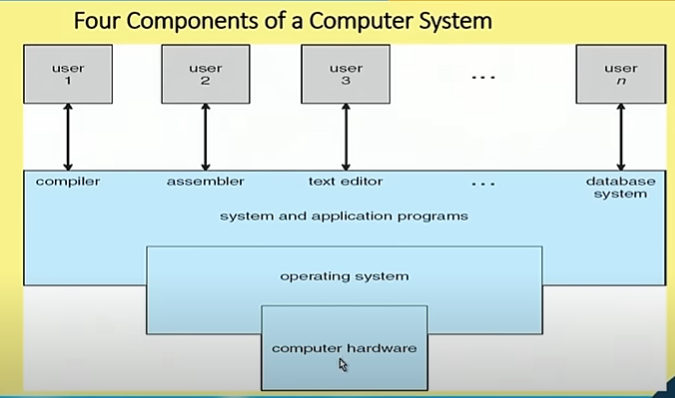

# Intro
* This is a fundamental course for beginners and GATE level aspirants will be benefitted
* Analogy => OS is the heart of the computer system
* What are the issues are handles by Operating System?
* Telephone Exchange OS
* Lab Server of a computer lab
* Get a glimpse of OS
* What are components
* Layered approach
* Layers of software
* Ultimately job is done by hardware
* Architectural level some support come => Evolution of OS
* Architectural development and OS developement
* Basic design of OS
* Integrated system
* Role of Architecture
* How programs are executed. Concept of Process
* Scheduling of Jobs. CPU Scheduling
* Memory Management policies, Virtual memory
* File system
* Synchronization issues, Dead lock

# Lecture 01
* What are components of OS
* Why do we need OS
* Microprocessor - Assembly language
* How OS evolved? and how it became easy for users? How evolution has taken place?

# Concepts covered
* What is an Operating System?  
* Computer-System Organization  
* Operating-System Structure  
* Operating-System Operations  
* Process Management  
* Memory Management  
    * Main Memory
    * Secondary Memory
    * Utilizing Memory
* Storage Management  
    * Hard disk
    * Optical disk
    * Difference between Memory and Storage Management
* Protection and Security  
* Kernel Data Structures  
    * Process table
    * Remembering the files
* Computing Environments  
    

# What is an Operating System?
* A program that acts as an intermediary between a user  
of a computer and the computer hardware
* Operating system goals:
    * Execute user programs and make solving user problems
    easier
        * e.g. Mouse Clicks through GUI
        * Basic operation are there but way has changed
    * Make the computer system convenient to use
        * e.g. Pen drive attaching display device
    * Use the computer hardware in an efficient manner
        * Resource Management
        * Resource should be available 
        * e.g. Printer job explanation

# Computer System Structure
* Computer system can be divided into four components:
    * Hardware — provides basic computing resources
        * CPU, memory, I/o devices
    * Operating system
        * Controls and coordinates use of hardware among various applications and users
    * Application programs — define the ways in which the system resources are used to solve the   
    computing problems of the users
        * Word processors, compilers, web browsers, database systems, video games
    * Users
        * People, machines, other computers

# User View
The user's view of the computer varies according to the interface being used.
* Single user computers (e.g., PC, workstations). Such systems are  
designed for one user to monopolize its resources. The goal is to  
maximize the work (or play) that the user is performing. The operating  
system is designed mostly for ease of use and good performance.  

* Multi user computers (e.g., mainframes, computing servers). These  
users share resources and may exchange information. The operating  
system in such cases is designed to maximize resource utilization -- to  
assure that all available CPU time, memory, and 1/0 are used efficient  
and that no individual users takes more than their air share.  