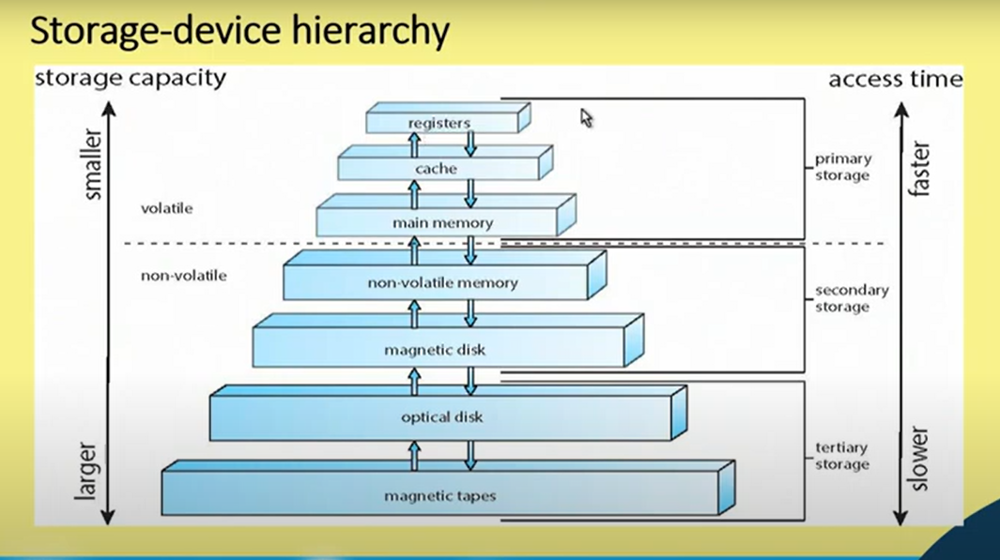
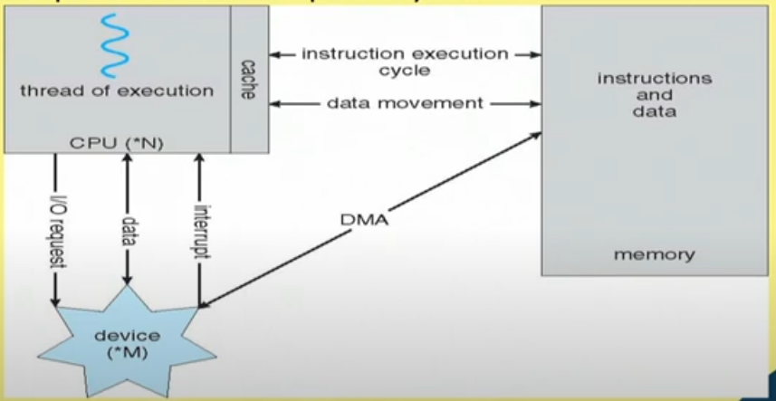

# Intro
* This is a fundamental course for beginners and GATE level aspirants will be benefitted
* Analogy => OS is the heart of the computer system
* What are the issues are handles by Operating System?
* Telephone Exchange OS
* Lab Server of a computer lab
* Get a glimpse of OS
* What are components
* Layered approach
* Layers of software
* Ultimately job is done by hardware
* Architectural level some support come => Evolution of OS
* Architectural development and OS developement
* Basic design of OS
* Integrated system
* Role of Architecture
* How programs are executed. Concept of Process
* Scheduling of Jobs. CPU Scheduling
* Memory Management policies, Virtual memory
* File system
* Synchronization issues, Dead lock

# Lecture 01
* What are components of OS
* Why do we need OS
* Microprocessor - Assembly language
* How OS evolved? and how it became easy for users? How evolution has taken place?

# Concepts covered
* What is an Operating System?  
* Computer-System Organization  
* Operating-System Structure  
* Operating-System Operations  
* Process Management  
* Memory Management  
    * Main Memory
    * Secondary Memory
    * Utilizing Memory
* Storage Management  
    * Hard disk
    * Optical disk
    * Difference between Memory and Storage Management
* Protection and Security  
* Kernel Data Structures  
    * Process table
    * Remembering the files
* Computing Environments  
    

# What is an Operating System?
* A program that acts as an intermediary between a user  
of a computer and the computer hardware
* Operating system goals:
    * Execute user programs and make solving user problems
    easier
        * e.g. Mouse Clicks through GUI
        * Basic operation are there but way has changed
    * Make the computer system convenient to use
        * e.g. Pen drive attaching display device
    * Use the computer hardware in an efficient manner
        * Resource Management
        * Resource should be available 
        * e.g. Printer job explanation

# Lecture 2

# Computer System Structure
* Computer system can be divided into four components:
    * Hardware — provides basic computing resources
        * CPU, memory, I/o devices
    * Operating system
        * Controls and coordinates use of hardware among various applications and users
    * Application programs — define the ways in which the system resources are used to solve the   
    computing problems of the users
        * Word processors, compilers, web browsers, database systems, video games
    * Users
        * People, machines, other computers

# User View
The user's view of the computer varies according to the interface being used.
* **Single user computers** (e.g., PC, workstations). Such systems are  
designed for one user to monopolize its resources. The goal is to  
maximize the work (or play) that the user is performing. The operating  
system is designed mostly for ease of use and good performance.  

* **Multi user computers** (e.g., mainframes, computing servers). These  
users share resources and may exchange information. The operating  
system in such cases is designed to maximize resource utilization -- to  
assure that all available CPU time, memory, and 1/0 are used efficient  
and that no individual users takes more than their air share.  

* **Handheld computers** (e.g., smartphones and tablets). The user   interface for mobile computers generally   
features a touch screen. The   systems are resource poor, optimized for usability and battery life.  

* **Embedded computers** (e.g., computers in home devices and   automobiles) The user interface may have numeric   
keypads and may turn   indicator lights on or off to show status. The operating systems are   designed primarily to   
run without user intervention.  

# System View
From the computer's POV, the OS is the program most intimately involved with the hardware.   
There are two different views:  

* The operating system is a **resource allocator**
    * Manages all resources
    * Decides between conflicting requests for efficient and fair resource use

* The operating system is a **control program**
    * Controls execution of programs to prevent errors and improper use of the computer

# Defining Operating System
No universally accepted definition of what an OS:

* Operating systems exist to offer a reasonable way to solve the problem of creating a usable computing system.
* The fundamental goal of computer systems is to execute user programs
and to make solving user problems easier.
* Since bare hardware alone is not particularly easy to use, application
programs are developed.
    * These programs require certain common operations, such as those controlling I/O devices.
    * The common functions of controlling and allocating resources brought together into one piece   
    of software: the operating system.

* A simple viewpoint is that it includes everything a vendor  
ships when you order the operating system. The features  
that are included vary greatly across systems:  
    * Some systems take up less than a megabyte of space and lack  
even a full-screen editor,
    * Some systems require gigabytes of space and are based entirely  
on graphical windowing systems.

* A more common definition, and the one that we usually follow, is that  
the operating system is the one program running at all times on the   
computer -- usually called the **kernel**.  

* Along with the kernel, there are two other types of programs:  
    * System programs, which are associated with the operating system but are not  
necessarily part of the kernel.
    * Application programs, which include all programs not associated with the  
operation of the system.

* The emergence of mobile devices, have resulted in an increase in  
the number of features that constituting the operating system.  
* Mobile operating systems often include not only a core kernel but  
also middleware -- a set of software frameworks that provide  
additional services to application developers.  
* For example, each of the two most prominent mobile operating  
systems -- Apple's iOS and Google's Android -- feature a core kernel  
along with middleware that supports databases, multimedia, and  
graphics (to name only a few).

# Lecture 3

## Computer-System Organization
* A modern general-purpose computer system consists of one or more CPUs and a number   
of device controllers connected through a common bus that provides access to shared memory.

* Each device controller is in charge of a specific type of device (For example, disk drives,  
audio devices, or video displays). Each device controller has a local buffer.

* CPU moves data from/to main memory to/from local buffers.  
* The CPU and the device controllers can execute in parallel, competing for   
memory cycles. To ensure orderly access to the shared memory, a memory controller   
synchronizes access to the memory

## Computer Startup
* **Bootstrap program** is loaded at power-up or reboot
    * Typically stored in ROM or EPROM, generally known as **firmware**
    * Initializes all aspects of system
    * Loads operating system kernel and starts execution

## Computer-System Operation
* Once the kernel is loaded and executing, it can start providing services 
to the system and its users.
* Some services are provided outside of the kernel, by system programs that   
are loaded into memory at boot time to become **system processes**, or system  
**daemons** that run the entire time the kernel is running.
* On UNIX, the first system process is **init** and it starts many other daemons.   
Once this phase is complete, the system is fully booted, and the system waits   
for some event to occur.
* The occurrence of an event is usually signaled by an **interrupt**.

> What happens when a computer is switched on?? Explain in terms of ROM, RAM, Hard disk, OS , Firmware  
boot device, booting operation.

## Interrupts
* There are two types of interrupts:
    * **Hardware** — a device may trigger an interrupt by sending a signal to the CPU,   
    usually by way of the system bus.
    * **Software** -- a program may trigger an interrupt by executing a special operation   
    called a **system call**.
* A software-generated interrupt (sometimes called **trap** or **exception**) is caused either by   
an error (e.g., divide by zero) or a user request (e.g., an
I/O request).
* An operating system is **interrupt driven.**

## Common Functions of Interrupts
* When an interrupt occurs, the operating system preserves the state of  
the CPU by storing the registers and the program counter
* Determines which type of interrupt has occurred and transfers control  
to the interrupt-service routine.
* An interrupt-service routine is a collection of routines (modules), each  
of which is responsible for handling one particular interrupt (e.g., from  
a printer, from a disk)
* The transfer is generally through the interrupt vector, which contains  
the addresses of all the service routines
* Interrupt architecture must save the address of the interrupted  
instruction.

# Interrupt Timeline

# Interrupt-driven I/O cycle

# Lecture 4 : Introduction (Contd.)
The image below is of an Interrupt vector table for the Intel Pentium processor.    
An interrupt vector table (IVT) is a table in memory that the processor uses to locate   
the Interrupt Service Routines (ISRs) for handling events like errors or device requests.    
The table contains 256 entries, one for each possible interrupt. Each entry points to the   
location of the ISR code that should be run in response to that particular interrupt.

The interrupt vector table allows the processor to quickly and efficiently respond to  
interrupts without having to search through memory for the appropriate ISR code.

The specific interrupt handlers shown in the image are for the Intel Pentium processor,   
but the general concept of interrupt vector tables applies to all x86 processors.

## Storage Structure
* Main memory— the only large storage media that the CPU can access directly
    * **Random access**
    * Typically **volatile**
* Secondary storage extension of main memory that provides large **nonvolatile** storage
capacity
    * Hard disks — rigid metal or glass platters covered with magnetic recording material  
        * Disk surface is logically divided into **tracks**, which are subdivided into **sectors**  
        * The **disk controller** determines the logical interaction between the device and  
the computer
    * **Solid-state disks** — faster than hard disks, nonvolatile
        * Various technologies
        * Becoming more popular
* Tertiary storage

## Storage Definition
* The basic unit of computer storage is the bit. A bit can contain one of  
two values, 0 and 1. All other storage in a computer is based on  
collections of bits.
* A byte is 8 bits, and on most computers it is the smallest convenient  
chunk of storage.
* A less common term is word, which is a given computer  
architecture's native unit of data. A word is made up of one or more  
bytes.
* Computer storage, along with most computer throughput, is generally  
measured and manipulated in bytes and collections of bytes.  
* Computer manufacturers often round off these numbers and say that a  
megabyte is 1 million bytes and a gigabyte is 1 billion bytes.
* Networking measurements are an exception to this general rule; they are  
given in bits (because networks move data a bit at a time).

## Storage Hierarchy
* Storage systems organized in hierarchy
    * Speed
    * Cost
    * Volatility
* **Caching** — copying information from "slow" storage into faster storage
system;
    * Main memory can be viewed as a cache for secondary storage
* **Device Driver** for each device controller to manage I/O
    * Provides uniform interface between controller and kernel

A storage device hierarchy refers to a system that organizes storage devices based on their   
speed, capacity, and cost. There are typically three tiers in a storage hierarchy:

* **Primary storage (main memory):** This is the fastest and most expensive type of storage.   
It is volatile, meaning that data is lost when the computer is turned off.
* **Secondary storage:** This type of storage is slower than primary storage but is non-volatile,   
meaning that data is retained even when the computer is powered down. Examples of secondary   
storage devices include hard disk drives (HDDs) and solid-state drives (SSDs).
* **Tertiary storage:** This is the slowest and least expensive type of storage. It is typically   
used to store data that is infrequently accessed. Examples of tertiary storage devices include   
magnetic tapes and optical disks.

The diagram you sent likely shows these three tiers of storage, along with their relative   
speeds and capacities. Here's a breakdown of what the tiers might represent:

* **Registers and Cache:** These are types of very-high-speed volatile memory that are located   
on the CPU itself or very close to it. They are used to store data that is currently being used   
by the processor.
* **Main Memory (RAM):** This is the primary storage for a computer. It is volatile and can be   
accessed quickly by the CPU.
* **Secondary Storage (HDD/SSD):** This is non-volatile storage that is slower than RAM but can   
store much larger amounts of data.
* **Tertiary Storage (Magnetic Tape/Optical Disk):** This is the slowest and least expensive type   
of storage. It is often used for backups or archiving data that is not accessed frequently.

The specific storage devices shown in the diagram may vary, but the general concept of a storage   
hierarchy remains the same. 

## I/O Structure
* A general-purpose computer system consists of CPUs and multiple device  
controllers that are connected through a common bus.
* Each device controller is in charge of a specific type of device. More than one  
device may be attached. For instance, seven or more devices can be attached to  
the **small computer-systems interface (SCSI)** controller.
* A device controller maintains some local buffer storage and a set of special-  
purpose registers.
* The device controller is responsible for moving the data between the peripheral  
devices that it controls and its local buffer storage.
* Typically, operating systems have a **device driver** for each device controller. The  
device driver understands the device controller and provides the rest of the  
operating system with a uniform interface to the device.
* To start an 1/0 operation, the device driver loads the appropriate registers
within the device controller.
* The device controller, in turn, examines the contents of these registers to  
determine what action to take (such as "read" a character from the keyboard).
* The controller starts the transfer of data from the device to its local buffer.  
Once the transfer of data is complete, the device controller informs the device  
driver via an interrupt that it has finished its operation.
* The device driver then returns control to the operating system, possibly  
returning the data or a pointer to the data if the operation was a read.
* For other operations, the device driver returns status information.

## Direct Memory Access Structure
* Interrupt-driven 1/0 is fine for moving small amounts of data but can produce high  
overhead when used for bulk data movement such as disk I/O.
* To solve this problem, **direct memory access** (DMA) is used.
* After setting up buffers, pointers, and counters for the 1/0 device, the device controller  
transfers an entire block of data directly to or from its own buffer storage to memory, with no  
intervention by the CPU.
* Only one interrupt is generated per block, to tell the device driver that the operation has  
completed. While the device controller is performing these operations, the CPU is available to  
accomplish other work.
* Some high-end systems use switch rather than bus architecture. On these  
systems, multiple components can talk to other components concurrently, rather  
than competing for cycles on a shared bus. In this case, DMA is even more
effective.

## How a Modern Computer Works
A von Neumann architecture and a depiction of the interplay of all components of a computer system.

The von Neumann architecture is a foundational computer design model introduced by   
John von Neumann in 1945.  It’s  influential in the design of most modern computers.   
Here are the key components:

* **Central Processing Unit (CPU):** This is the brain of the computer and is responsible for     
executing instructions. It contains two main sub-units:
    * **Control Unit (CU):** The CU fetches instructions from memory, decodes them, and controls   
    the flow of data throughout the system.
    * **Arithmetic Logic Unit (ALU):** The ALU performs mathematical and logical operations on data.
* **Memory:** This stores data and instructions that the CPU needs to access.  There are two main types of memory:
    * **Primary memory (RAM):** This is volatile memory, meaning data is lost when the computer is   
    powered off. It’s fast and used to store data that the CPU is actively using.
    * **Secondary memory (hard drives, SSDs):** This is non-volatile memory, meaning data is retained   
    even when the computer is powered off. It’s slower than RAM but can store much larger amounts of data.
* **Input/Output (I/O):** These are devices that allow the computer to interact with the external world.   
Examples include keyboards, monitors, printers, and network cards.
* **Bus:** This is a pathway that allows data to flow between different parts of the computer.   
There are three main types of buses:
    * **Data bus:** carries data between the CPU and memory or I/O devices.
    * **Address bus:** carries the memory address of the data being transferred.
    * **Control bus:** carries control signals that coordinate the flow of data between different   
    parts of the computer.

The von Neumann architecture is a simple and elegant design that has been very successful.   
However, it also has some limitations. One limitation is the von Neumann bottleneck, which   
is a performance bottleneck that can occur because the CPU, memory, and I/O devices all share   
the same bus. This means that only one operation can occur on the bus at a time.

Here are some additional points to consider:

* The  model depicts a stored-program computer, where program instructions are stored in memory   
alongside data. This is a key feature of the von Neumann architecture and allows for flexible and   
versatile computing.
* Modern computer systems may deviate somewhat from the strict von Neumann design. For instance,    
cache memory can be used to improve performance by storing frequently accessed data closer to the CPU.    
Also,  multiple cores or processors may be present within a single CPU.