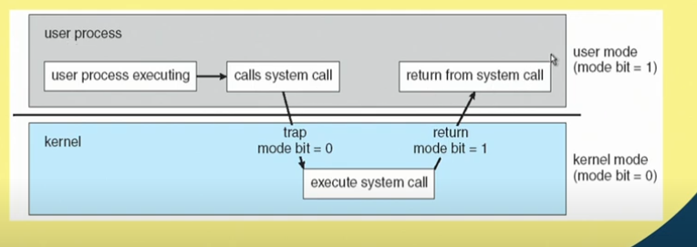
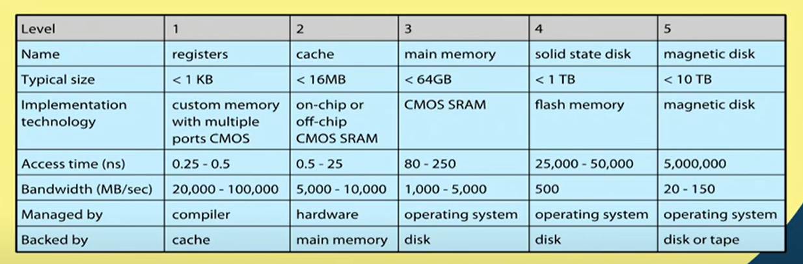

# Lecture 6 : Introduction (Contd.)

## Transition from User to Kernel Mode

The Image above is about the transition between user mode and kernel mode in a computer system. 

**User Mode vs. Kernel Mode**

* **User mode** is a restricted environment where application programs run.   
In user mode, programs have limited access to system resources and cannot directly   
interact with hardware. This helps to protect the system from errors and crashes   
caused by buggy applications.
* **Kernel mode** is a privileged environment where the operating system kernel runs.   
The kernel has full access to system resources and can interact directly with hardware.   
This gives the kernel the ability to control and manage the entire system.

**Transition from User Mode to Kernel Mode**

The image shows the process of how a user program transitions from user mode to   
kernel mode. Here's a breakdown of the steps:

1. **User process executing:** The user process is running in user mode and is executing instructions.
2. **Calls system call:** The user process makes a system call. A system call is an API (application   
programming  interface) that allows user programs to request services from the operating system kernel.   
When a system call is made, the program switches from user mode to kernel mode.
3. **Trap (mode bit = 0):** A trap or interrupt occurs, which changes the processor's mode   
bit from 1 (user mode) to 0  
(kernel mode). This triggers the CPU to stop executing the user program and start executing   
the kernel code that handles  the system call.
4. **Kernel mode:** The CPU is now in kernel mode. The kernel code that handles the system   
call is executed.
5. **Executes system call:** The kernel code performs the requested operation on behalf of the user   
program. This may involve accessing hardware devices, managing memory, or other system resources.
6. **Return from system call:** Once the system call is complete, the kernel code returns   
control to the user program.
7. **Return (mode bit = 1):** The CPU's mode bit is switched back to 1, indicating a return   
to user mode.
8. **User mode:** The user program resumes execution from where it left off before the   
system call.

**Why is the Transition from User to Kernel Mode Important?**

This transition is important for security and protection. By restricting user programs to user mode,   
the system prevents them from directly accessing hardware or modifying critical system resources.   
This helps to ensure the stability and integrity of the operating system.

The kernel mode provides a safe and controlled environment for the operating system to manage the system's   
resources. It can ensure fair allocation of resources among multiple programs and prevent programs from   
interfering with each other.

## Timer
To prevent process to be in infinite loop (process hogging resources), a timer is used,   
which is a hardware device.

* Timer is a counter that is decremented by the physical clock.
* Timer is set to interrupt the computer after some time period
* Operating system sets the counter (privileged instruction)
* When counter reaches the value zero, and interrupt is generated.
* The OS sets up the value of the counter before scheduling a
process to regain control or terminate program that exceeds
allotted time

## Process Management
* A process is a program in execution. It is a unit of work within the system.   
Program is a
passive entity, process is an active entity.
* Process needs resources to accomplish its task
    * CPU, memory, 1/0, files, etc.
    * Initialization data
* Process termination requires reclaim of any reusable resources
* A thread is a basic unit of CPU utilization within a process.
    * Single-threaded process. Instructions are executed sequentially, one at a time,   
    until completion
        * Process has one program counter specifying location of next instruction to execute
* Multi-threaded process has one program counter per thread
* Typically, a system has many processes, some user, some operating system
running concurrently on one or more CPUs
* Concurreny by multiplexing the CPUs among the threads

## Process Management Activities
The operating system is responsible for the following activities in connection with   
process management
* Creating and deleting both user and system processes
* Suspending and resuming processes
* Providing mechanisms for process synchronization
* Providing mechanisms for process communication
* Providing mechanisms for deadlock handling

## Memory Management
* To execute a program all (or part) of the instructions must be in memory
* All (or part) of the data that is needed by the program must be in memory.
* Memory management determines what is in memory and when
    * Optimizing CPU utilization and computer response to users
* Memory management activities
    * Keeping track of which parts of memory are currently being used and by whom
    * Deciding which processes (or parts thereof) and data to move into and out of memory
    * Allocating and deallocating memory space as needed

## Storage Management
* OS provides uniform, logical view of information storage
* Abstracts physical properties to logical storage unit - **file**
* Files are stored in a number of different storage medium.
    * Disk
    * Flash Memory
    * Tape
* Each medium is controlled by device drivers (i.e., disk drive, tape drive)
    * Varying properties include access speed, capacity, data-transfer rate,   
    access method (sequential or random)

## File System Management
* Files usually organized into directories
* Access control on most systems to determine who can access what
* OS activities include
    * Creating and deleting files and directories
    * Primitives to manipulate files and directories
    * Mapping files onto secondary storage
    * Backup files onto stable (non-volatile) storage media

## Secondary-Storage Management
* Usually disks used to store data that does not fit in main memory or data that   
must be kept for a "long" period of time
* Proper management is of central importance
* Entire speed of computer operation hinges on disk subsystem and its algorithms
* OS activities
    * Free-space management
    * Storage allocation
    * Disk scheduling
* Some storage need not be fast
    * Tertiary storage includes optical storage, magnetic tape
    * Still must be managed by OS or applications

## Caching
* Important principle, performed at many levels in a computer (in hardware, operating system,   
software)
* Information in use copied from slower to faster storage temporarily
* Faster storage (cache) checked first to determine if information is there
    * If it is, information used directly from the cache (fast)
    * If not, data copied to cache and used there
* Cache are smaller (size-wise) than storage being cached
    * Cache management important design problem
    * Cache size and replacement policy

## Performance of Various Levels of Storage
    

Movement between levels of Storage hierarchy can be explicit or implicit

## Migration of data "A" from Disk to Register
* Multitasking environments must be careful to use most recent value, no matter where it is   
stored in the storage hierarchy

* Multiprocessor environment must provide **cache coherency** in
hardware such that all CPUs have the mbst recent value in their cache
* Distributed environment situation even more complex
* Several copies of a datum can exist

## I/O Subsystem
* One purpose of an operating system is to hide peculiarities of hardware devices from the user
* I/O subsystem responsible for
    * Memory management of 1/0 including buffering (storing data temporarily while it is being   
    transferred), caching (storing parts of data in faster storage for performance), spooling   
    (the overlapping of output of one job with input of other jobs)
* General device-driver interface
* Drivers for specific hardware devices

## Protection and Security

* Protection —A mechanism for controlling access of processes (or users) to
resources defined by the OS
* Security— A defense of the system against internal and external attacks
    * Huge range, including denial-of-service, worms, viruses, identity theft, theft of service
* Systems generally first distinguish among users, to determine who can do what
    * User identities (user IDs, security IDs) include name and associated number, one per user
    * User ID is associated with all files and processes of that user to determine access control
    * Group identifier (group ID) allows set of users to be defined and controls manage then also   
    associated with each process, file
    * Privilege escalation allows user to change to effective ID with more rights

## Conclusion :
* Operating system acts as an interface between
computer hardware and users
* Makes the system usable in an user-friendly manner
* Controls usage of different hardware and software
resources in a computer system
* What is an Operating System?
* Specific activities include:
    * Process Management
    * Memory Management
    * Storage Management
    * Protection and Security