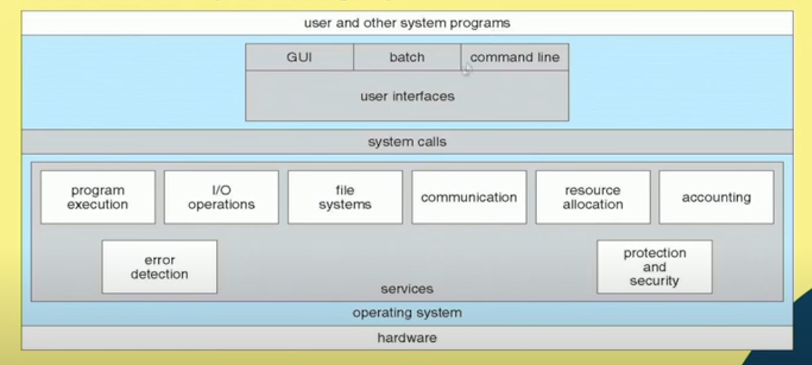

# Lecture 8 : Operating System Structures (Contd.)

## A View of Operating System Services

Above image is a diagram of a computer operating system showing the services it provides.   
The operating system acts as an intermediary between the user and the computer hardware,   
providing a layer of abstraction that makes the computer easier to use and program.   
Here's a breakdown of the sections in the diagram:

* **User and Other System Programs:** This section refers to the various software programs that users can   
interact with, such as word processors, web browsers, and games. It can also include system programs that   
are used to manage the computer, such as utilities and configuration tools.

* **User Interfaces:** This section refers to the way users interact with the computer system. It can   
include graphical user interfaces (GUIs) that use windows, icons, and menus, or command-line interfaces   
(CLIs) that use text commands.

* **System Calls:**  These are functions provided by the operating system that allow user programs to request   
specific services from the kernel.  The kernel is the core part of the operating system that has privileged   
access to hardware and system resources.  When a user program makes a system call, it switches from user mode   
to kernel mode to execute the requested service.

* **System Services:** These are the core functionalities provided by the operating system. Some examples of   
system services include:

    * **Program execution:** The operating system loads programs into memory and executes them.
    * **I/O (Input/Output) management:** The operating system manages the communication between the computer   
    and peripheral devices such as printers, disks, and keyboards.
    * **File management:** The operating system creates, deletes, reads, writes, and organizes files on   
    storage devices.
    * **Memory management:** The operating system allocates and deallocates memory for programs and data.
    * **Process management:** The operating system creates and terminates processes, which are instances of   
    running programs.
    * **Security and protection:** The operating system protects the system from unauthorized access and ensures   
    that programs cannot interfere with each other.

* **Hardware:** This section refers to the physical components of the computer system, such as the CPU, memory,   
storage devices, and input/output devices.

* **Software:** This section refers to the programs and data that are stored on the computer system.

Overall, the diagram depicts the various components that work together to form a functional computer   
operating system. The operating system plays a crucial role in providing a user-friendly interface,   
managing system resources, and ensuring the smooth operation of the computer system.

## Command Interpreters (CLI)
CLI allows users to directly enter commands to be performed by the operating system.  
* Some operating systems include the command interpreter in the kernel.
* Some operating systems, such as Windows and UNIX, treat the command interpreter as a special program   
that is running when a job is initiated or when a user first logs on.
* On systems with multiple command interpreters to choose from, the interpreters are known as **shells.**
* The main function of the command interpreter is to get and execute the next user-specified command.
* Sometimes commands built-in, sometimes just names of programs
* If the latter, adding new features doesn't require shell modification

>  sh - Bourne Shell  
csh - c shell

## The Bourne shell command interpreter in Solaris

## Graphical User Interfaces (GUI)
* User-friendly desktop metaphor interface
    * Usually mouse, keyboard, and monitor
    * Icons represent files, programs, actions. etc
    * Various mouse buttons over objects in the interface cause various actions (provide information, options,   
    execute function. open directory (known as a folder)
    * Invented at Xerox PARC
* Many systems now include both CLI and GUI interfaces
    * Microsoft Windows is GUI with CLI "command" shell
    * Apple Mac OS X is "Aqua" GUI interface with UNIX kernel underneath and  shells available
    * Unix and Linux have CLI with optional GUI interfaces (CDE, KDE, GNOME)

## Touchsceen Interfaces
* Touchscreen devices require new interfaces
    * Mouse not possible or not desired
    * Actions and selection based on gestures
    * Virtual keyboard for text entry
* Voice commands

## System Calls
* Programming interface to the services provided by the OS
* Typically written in a high-level language (C or C++)
* Mostly accessed by programs via a high-level Application
Programming Interface (API) rather than direct system call
* Three most common APIs are:
    * Win32 API for Windows,
    * POSIX API for POSIX-based systems (including virtually all versions of UNIX,   
    Linux, and Mac OS X),
    * Java API for the Java virtual machine (JVM)

## Example of System Calls
* System call sequence to copy the contents of one file to another file

## Example of Standard API
In windows we can do it by /?   
e.g. `ipconfig /?`

## System Call Implementation
* Typically, a number is associated with each system call
    * System-call interface maintains a table indexed according to these numbers
* The system call interface invokes the intended system call in OS kernel and returns
status of the system call and any return values
* The caller need not know a thing about how the system call is implemented
    * Just needs to obey the API and understand what the OS will do as a result call
    * Most details of OS interface hidden from programmer by API
        * Managed by run-time support library (set of functions built into libraries
included with compiler)
