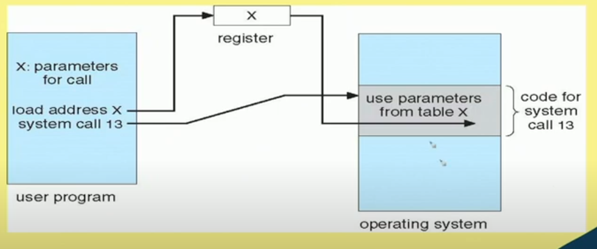

# Lecture 9

# Parameter Passing via Table
x points to a block of parameters. x is loaded into a register

## Types of System Calls
* System calls can be grouped roughly into six major categories:
    * Process control,
    * File manipulation,
    * Device manipulation,
    * Information maintenance,
    * Communications,
    * protection.
* The figure in the slide # 28 summarizes the types of system
calls normally provided by an operating system.

## System Calls - Process Control
* create process, terminate process
* end, abort
* load, execute
* get process attributes, set process attributes
* wait for time
* wait event, signal event
* allocate and free memory
* Dump memory if error
* Debugger for determining bugs, single step
execution
* Locks for managing access to shared data between processes

## System Calls - File Management
* Create file
* Delete file
* Open and Close file
* Read, Write, Reposition
* Get and Set file attributes

## System Calls - Device Management
* request device, release device
* read, write, reposition
* get device attributes, set device attributes
* logically attach or detach devices

## System Calls -- Information Maintenance
* get time or date,
* set time or date
* get system data,
* set system data
* get and set process, file, or device attributes

## System Calls --f Communications
* create, delete communication connection
* if **message passing model:**
    * send, receive message
        * To host name or process name
        * From client to server
* If **shared-memory model:**
    * create and gain access to memory regions
* transfer status information
* attach and detach remote devices

## System Calls -- Protection
* Control access to resources
* Get and set permissions
* Allow and deny user access

