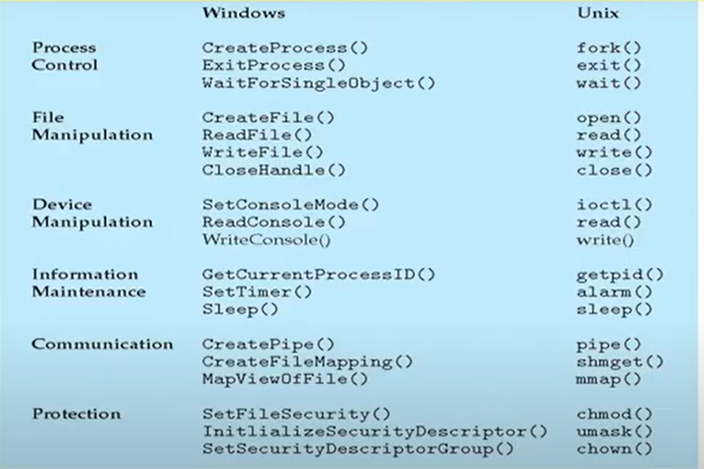
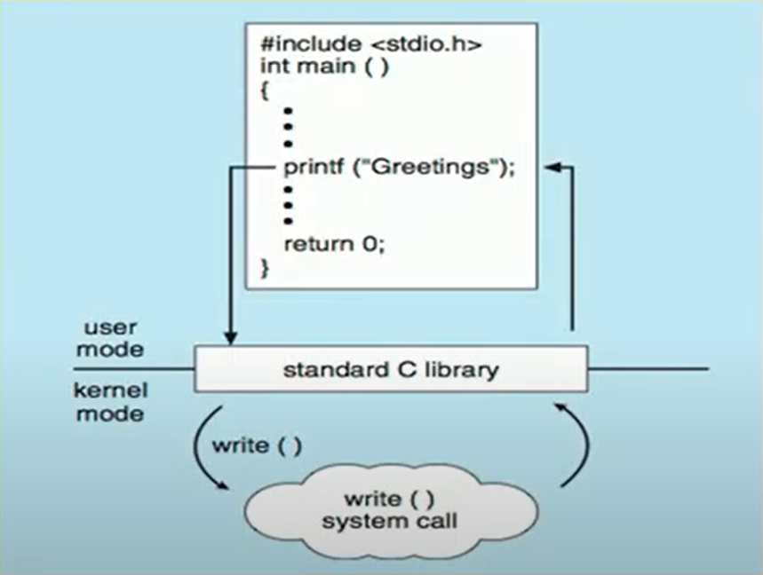

# Lecture 9

# Parameter Passing via Table
x points to a block of parameters. x is loaded into a register

## Types of System Calls
* System calls can be grouped roughly into six major categories:
    * Process control,
    * File manipulation,
    * Device manipulation,
    * Information maintenance,
    * Communications,
    * protection.
* The figure in the slide # 28 summarizes the types of system
calls normally provided by an operating system.

## System Calls - Process Control
* create process, terminate process
* end, abort
* load, execute
* get process attributes, set process attributes
* wait for time
* wait event, signal event
* allocate and free memory
* Dump memory if error
* Debugger for determining bugs, single step
execution
* Locks for managing access to shared data between processes

## System Calls - File Management
* Create file
* Delete file
* Open and Close file
* Read, Write, Reposition
* Get and Set file attributes

## System Calls - Device Management
* request device, release device
* read, write, reposition
* get device attributes, set device attributes
* logically attach or detach devices

## System Calls -- Information Maintenance
* get time or date,
* set time or date
* get system data,
* set system data
* get and set process, file, or device attributes

## System Calls --f Communications
* create, delete communication connection
* if **message passing model:**
    * send, receive message
        * To host name or process name
        * From client to server
* If **shared-memory model:**
    * create and gain access to memory regions
* transfer status information
* attach and detach remote devices

## System Calls -- Protection
* Control access to resources
* Get and set permissions
* Allow and deny user access

## Examples of Windows and Unix System Calls

## Example -- Standard C library

C program invoking printf() library call, which call write() system call

## System Programs
* System programs provide a convenient environment for program
development and execution.
* Some of them are simply user interfaces to system calls. Others are
considerably more complex.
* They can be divided into:
    * File manipulation
    * Status information sometimes stored in a File modification
    * Programming language support
    * Program loading and execution
    * Communications
    * Background services
    * Application programs
* Most users' view of the operation system is defined by system
programs, not the actual system calls

## System Programs

* File management
    * Create, delete, copy, rename, print, dump, list, and generally manipulate files 
    and directories

* Status information
    * Some programs ask the system for information - date, time, amount of available memory, disk space,   
    number of users
    * Others programs provide detailed performance, logging, and
debugging information
    * Typically, these programs format and print the output to the
terminal or other output devices
    * Some systems implement a registry - used to store and retrieve
configuration information

## System Programs (Cont.)
* **File modification**
    * Text editors to create and modify files
    * Special commands to search contents of files or perform transformations of the text  
* **Programming-language support** - Compilers, assemblers, debuggers and
interpreters sometimes provided
* **Program loading and execution**- Absolute loaders, relocatable loaders, linkage  
editors, and overlay-loaders, debugging systems for higher-level and machine
language
* **Communications** - Provide the mechanism for creating virtual connections  
among processes, users, and computer systems
• Allow users to send messages to one another's screens, browse web pages,  
send electronic-mail messages, log in remotely, transfer files from one machine  
to another

